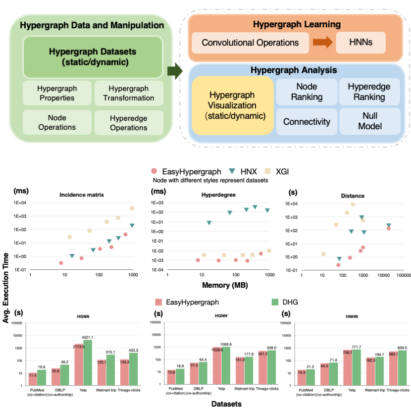

# EasyHypergraph: an open-source software for fast and memory-saving analysis and learning of higher-order networks

[Bodian Ye](https://bdye.mysxl.cn/), [Min Gao](https://mgao97.github.io/), [Xiu-Xiu Zhan](https://scholar.google.com/citations?user=N6n_MhEAAAAJ&hl=zh-CN&oi=sra), [Xinlei He](https://xinleihe.github.io/), [Zi-Ke Zhang](https://scholar.google.com/citations?user=jtQ2xZMAAAAJ&hl=zh-CN&oi=ao), [Qingyuan Gong](https://gongqingyuan.wordpress.com/), [Xin Wang](https://scholar.google.com/citations?hl=zh-CN&user=qvpWjSsAAAAJ&view_op=list_works&sortby=pubdate), [Yang Chen](https://chenyang03.wordpress.com/)

## Introduction
We present a comprehensive, computation-effective, and storage-saving hypergraph library designed not only for in-depth hypergraph analysis but also for the growing field of hypergraph learning. The library, called EasyHypergraph, allows users from multiple disciplines to input hypergraph data, efficiently perform hypergraph
analysis or hypergraph learning tasks on large-scale datasets by utilizing computational workflow, and gain insights from higher-order structures. EasyHypergraph’s broad capabilities and computational efficiency empower researchers and practitioners from various fields to effectively harness the potential of higher-order networks,
sparking innovative solutions for practical problems.

 

## Installation

### Environment
The Ubuntu 20.04 Server features an Intel(R) Xeon(R) CPU E5 - 2690 v2 with a clock speed of 3.00GHz and 31 GB of RAM for hypergraph analysis, 
and one server with an Intel(R) Xeon(R) Silver 4114 CPU @ 2.20GHz and 187GB of RAM for hypergraph learning.  

### Supported Python
3.8 <= Python <= 3.13 is required.

### Package install
```
pip install --upgrade Python-EasyGraph
```
or
```
    git clone --recursive https://github.com/easy-graph/Easy-Graph
    export EASYGRAPH_ENABLE_GPU="TRUE"  # for users who want to enable GPUs
    pip install ./Easy-Graph
```

## Usage

### Related source code

- Easy-Graph/easygraph/classes/hypergraph.py
- Easy-Graph/easygraph/functions/hypergraph
- Easy-Graph/easygraph/datasets/hypergraph
- Easy-Graph/easygraph/model/hypergraphs
- Easy-Graph/easygraph/nn

### hypergraph_analysis_experiments

```
cd hypergraph_analysis_experiments
python metric_benchmark.py
```


### Hypergraph learning experiments

```
cd hypergraph_learning_experiments
bash start_pipeline.sh
```


### Datasets
All datasets from eg_hypergraph_dataset.zip or integrated dataset in https://easy-graph.github.io/docs/reference/easygraph.datasets.html
